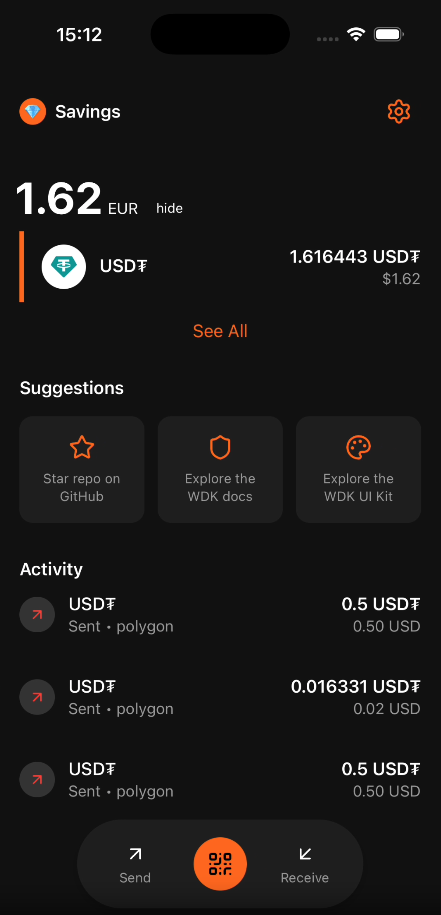

# @tetherto/wdk-starter-react-native

> [!WARNING]
> **Alpha Software**
> 
> This starter template is currently in **alpha** stage and under active development. It may contain bugs, incomplete features, and breaking changes. **Do not use in production environments or with real funds.** 
> 
> For production use, please wait for the stable release or use at your own risk in development/testing environments only.

An Expo + React Native starter demonstrating how to build a secure, multi-chain, non-custodial wallet using the WDK (Wallet Development Kit). This wallet uses **ERC-4337 (Account Abstraction)** with **Safe smart contract accounts** on EVM networks, enabling gasless transactions through paymasters. Features BareKit worklets for cryptographic operations, secure secret management, and a complete wallet implementation with onboarding, transactions, and asset management.

> **Note**: This starter currently implements ERC-4337 Safe accounts for EVM networks. Support for regular EOA (Externally Owned Account) wallets on additional networks is planned for future releases.

Click below to see the wallet in action:

[](assets/docs/demo.mp4)

## 🔍 About WDK

This repository is part of the [**WDK (Wallet Development Kit)**](https://wallet.tether.io/) project, which empowers developers to build secure, non-custodial wallets with unified blockchain access, stateless architecture, and complete user control. 

For detailed documentation about the complete WDK ecosystem, visit [docs.wallet.tether.io](https://docs.wallet.tether.io).

## 🌟 Features

### Multi-Chain Support (ERC-4337 Safe Accounts)
- **Ethereum**: Safe smart contract account with gas sponsorship via paymaster
- **Polygon**: Safe account with low-cost transactions and gas sponsorship
- **Arbitrum**: Safe account on Layer 2 with gas sponsorship support
- **Plasma**: Safe account on Tether's native Layer 2 network
- **Sepolia**: Safe account on Ethereum testnet for development
- **Spark**: Bitcoin Layer 2 with instant transfers (native Bitcoin addresses)

### Network Mode Toggle
- **Mainnet/Testnet Switch**: Easy toggle between mainnet and testnet in settings
- **Automatic Refresh**: Balance and token lists update when switching modes
- **Consistent State**: All screens respect the current network mode

### Multi-Token Support
- **BTC**: Bitcoin on Spark network
- **USD₮ (Tether USD)**: Multi-chain USD₮ support (Ethereum, Polygon, Arbitrum, Plasma, Spark)
- **XAU₮ (Tether Gold)**: Gold-backed stablecoin on Ethereum

### Wallet Management
- **Secure Seed Generation**: Cryptographically secure 12-word mnemonic generation
- **Seed Import**: Import existing BIP39-compatible mnemonic phrases
- **Encrypted Storage**: Secure key storage via native secure storage (iOS Keychain, Android KeyStore)
- **Biometric Authentication**: Face ID/Touch ID for wallet unlock
- **Wallet Naming**: Custom wallet names for better organization

### Asset Management
- **Real-Time Balances**: Live balance updates via [WDK Indexer](https://docs.wallet.tether.io/)
- **Transaction History**: Complete transaction tracking and history
- **Price Conversion**: Real-time fiat pricing via Bitfinex integration
- **Multi-Asset View**: Aggregate portfolio view across all tokens and chains
- **Asset Details**: Detailed views for individual tokens with transaction history

### User Experience
- **QR Code Scanner**: Scan wallet addresses and payment requests via camera
- **Send Flows**: Complete send flow with network and token selection
- **Receive Flows**: Generate QR codes for receiving payments
- **Activity Feed**: Real-time transaction monitoring with status updates
- **Settings**: Wallet management, security, and app preferences
- **Dark Mode**: Modern dark theme optimized for readability

## 🧱 Platform Prerequisites

- Node.js >= 20.19.4
- iOS: Xcode toolchain
- Android: SDK (see `app.json` build properties for version requirements)

## ⬇️ Installation

Clone this repository and install dependencies:

```bash
npm install
```

## 🔑 Environment Setup

**Optional but Recommended:** Configure API keys for balance, transaction data, and Tron network support:

```bash
# Copy the example environment file
cp .env.example .env

# Edit .env and configure the following:
# EXPO_PUBLIC_WDK_INDEXER_BASE_URL=https://wdk-api.tether.io
# EXPO_PUBLIC_WDK_INDEXER_API_KEY=your_wdk_api_key_here
# EXPO_PUBLIC_TRON_API_KEY=your_tron_api_key_here (optional, for Tron network)
# EXPO_PUBLIC_TRON_API_SECRET=your_tron_api_secret_here (optional, for Tron network)
```

**Note:** The WDK Indexer API key is used for balance and transaction API requests. While not mandatory for development, it enables full functionality. Tron API keys are optional and only needed if you want to use the Tron network. Get your free WDK Indexer API key in the [WDK docs](https://docs.wallet.tether.io/).

## 🔧 Provider Configuration (Recommended)

**For Better Performance:** The app uses public RPC endpoints by default, which may have rate limits and variable performance. For a better experience, customize provider URLs in `src/config/get-chains-config.ts`:

### Customizable Endpoints

Edit `src/config/get-chains-config.ts` to update these provider URLs:

**Ethereum**
```typescript
ethereum: {
  provider: 'https://eth.merkle.io',  // Replace with your Ethereum RPC URL
  bundlerUrl: 'https://api.candide.dev/public/v3/ethereum',
  paymasterUrl: 'https://api.candide.dev/public/v3/ethereum',
}
```

**Arbitrum**
```typescript
arbitrum: {
  provider: 'https://arb1.arbitrum.io/rpc',  // Replace with your Arbitrum RPC URL
  bundlerUrl: 'https://api.candide.dev/public/v3/arbitrum',
  paymasterUrl: 'https://api.candide.dev/public/v3/arbitrum',
}
```

Do the same for other chains.


## 🚀 Run

Then start the app:

```bash
# iOS simulator
npm run ios

# Android emulator/device
npm run android
```

## 📁 Project Structure

```
src/
├── app/                         # App screens (Expo Router file-based routing)
│   ├── _layout.tsx              # Root layout with providers
│   ├── index.tsx                # Entry point & routing logic
│   ├── onboarding/              # Onboarding flow screens
│   ├── wallet-setup/            # Wallet creation/import flows
│   ├── wallet.tsx               # Main wallet dashboard
│   ├── assets.tsx               # Asset list screen
│   ├── activity.tsx             # Transaction history
│   ├── send/                    # Send flow screens
│   ├── receive/                 # Receive flow screens
│   ├── authorize.tsx            # Biometric authentication
│   ├── settings.tsx             # App settings
│   ├── scan-qr.tsx              # QR code scanner
│   └── token-details.tsx        # Individual token details
├── components/                  # Reusable UI components
│   ├── onboarding/              # Onboarding components
│   ├── ui/                      # Base UI components
│   └── *.tsx                    # Shared components
├── config/                      # Configuration files
│   ├── assets.ts                # Token/asset configurations
│   ├── avatar-options.ts        # Wallet avatar configurations
│   ├── networks.ts              # Network configurations
│   └── get-chains-config.ts     # Chain-specific settings & provider URLs
├── services/                    # Business logic & external services
│   └── pricing-service.ts       # Fiat pricing via Bitfinex
├── hooks/                       # Custom React hooks
│   ├── use-debounced-navigation.ts  # Debounced navigation to prevent rapid taps
│   ├── use-keyboard.ts          # Keyboard visibility detection
│   └── use-wallet-avatar.ts     # Wallet avatar management
└── utils/                       # Utility functions
    ├── gas-fee-calculator.ts    # Gas fee estimation & network utilities
    ├── format-amount.ts         # Amount formatting helpers
    ├── format-token-amount.ts   # Token-specific amount formatting
    ├── format-usd-value.ts      # USD value formatting
    ├── get-display-symbol.ts    # Token symbol display utilities
    ├── get-denomination-value.ts # Token denomination utilities
    ├── parse-worklet-error.ts   # Worklet error parsing for better UX
    └── recent-tokens.ts         # Recent token tracking
```

## 🏗️ Architecture & Key Flows

### App Architecture
The app follows a clean architecture pattern with clear separation of concerns:

1. **Providers Layer** (`_layout.tsx`)
   - `WalletProvider`: Manages wallet state, ERC-4337 Safe accounts, blockchain interactions, and WDK service
   - `ThemeProvider`: Handles dark mode and custom theming
   - `NavigationThemeProvider`: React Navigation theme configuration

2. **Screen Layer** (`app/` directory)
   - File-based routing via Expo Router
   - Each screen is a self-contained React component
   - Navigation handled automatically based on file structure

3. **Business Logic** (`services/` directory)
   - Pricing service for real-time fiat conversion

4. **Configuration** (`config/` directory)
   - Centralized network and asset configurations
   - Chain-specific RPC endpoints and settings

### User Flows

#### First-Time User (Create Wallet)
1. **Onboarding** → View welcome screen with app features
2. **Wallet Setup** → Choose "Create New Wallet"
3. **Name Wallet** → Set a custom wallet name
4. **Secure Wallet** → View and backup 12-word seed phrase
5. **Confirm Phrase** → Verify seed phrase knowledge
6. **Complete** → Wallet created and unlocked
7. **Wallet Dashboard** → Access main wallet interface

#### Returning User (Import Wallet)
1. **Onboarding** → View welcome screen
2. **Wallet Setup** → Choose "Import Existing Wallet"
3. **Import Wallet** → Enter 12-word seed phrase
4. **Name Wallet** → Set a custom wallet name
5. **Complete** → Wallet imported and unlocked
6. **Wallet Dashboard** → Access main wallet interface

#### Existing User (App Launch)
1. **Entry Point** (`index.tsx`) → Check wallet status
2. **Authorization** → Biometric authentication (Face ID/Touch ID)
3. **Wallet Dashboard** → Access wallet after unlock

#### Send Flow
1. **Wallet Dashboard** → Tap "Send" button
2. **Select Token** → Choose token to send (BTC, USD₮, XAU₮)
3. **Select Network** → Choose blockchain network
4. **Send Details** → Enter recipient address, amount, and review fees
5. **Confirm** → Approve transaction
6. **Transaction Submitted** → View transaction status

#### Receive Flow
1. **Wallet Dashboard** → Tap "Receive" button
2. **Select Token** → Choose token to receive
3. **Select Network** → Choose blockchain network
4. **Receive Details** → View QR code and address, copy or share

## 🌐 Supported Networks & Operations

This starter supports the following blockchain networks and operations:

### Mainnet Networks (ERC-4337 Safe Accounts)
| Network | Account Type | Balance | History | Send | Receive | Gas Sponsorship |
|---------|--------------|---------|---------|------|---------|-----------------|
| **Ethereum** | Safe (ERC-4337) | ✅ | ✅ | ✅ | ✅ | ✅ |
| **Polygon** | Safe (ERC-4337) | ✅ | ✅ | ✅ | ✅ | ✅ |
| **Arbitrum** | Safe (ERC-4337) | ✅ | ✅ | ✅ | ✅ | ✅ |
| **Plasma** | Safe (ERC-4337) | ✅ | ✅ | ✅ | ✅ | ✅ |
| **Spark** | Native (Bitcoin) | ✅ | ✅ | ✅ | ✅ | N/A |

### Testnet Networks
| Network | Account Type | Balance | History | Send | Receive | Gas Sponsorship |
|---------|--------------|---------|---------|------|---------|-----------------|
| **Sepolia** | Safe (ERC-4337) | ✅ | ✅ | ✅ | ✅ | ✅ |
| **Spark (Regtest)** | Native (Bitcoin) | ✅ | ✅ | ✅ | ✅ | N/A |

### Token Support

| Token | Symbol | Networks (Account Type) |
|-------|--------|-------------------------|
| **Bitcoin** | BTC | Spark (Native) |
| **Tether USD** | USD₮ | Ethereum (Safe), Polygon (Safe), Arbitrum (Safe), Plasma (Safe), Spark (Native), Sepolia (Safe) |
| **Tether Gold** | XAU₮ | Ethereum (Safe) |

### Key Features
- **ERC-4337 Safe Accounts**: All EVM networks use Safe smart contract accounts for enhanced security and flexibility
- **Gas Sponsorship**: EVM networks (Ethereum, Polygon, Arbitrum, Plasma) offer gasless transactions via paymasters - users don't need native tokens for gas
- **Multi-Network**: Send the same token across different networks based on preference and fees
- **Real-Time Data**: Live balance and transaction updates via WDK Indexer
- **QR Code Support**: Generate and scan QR codes for easy address sharing

## 🔒 Security Features

This starter implements multiple layers of security for protecting user assets:

### Smart Contract Account Security (ERC-4337)
- **Safe Accounts**: EVM networks use battle-tested Safe smart contract accounts
- **Account Abstraction**: Enhanced transaction validation and execution logic
- **Gasless Transactions**: Users don't need native tokens for gas - transactions are sponsored via paymasters
- **Future Flexibility**: Smart contract accounts enable future features like social recovery, spending limits, and multi-sig

### Secure Key Management
- **BareKit Worklets**: Cryptographic operations run in isolated worklet context
- **Secret Manager**: Keys stored encrypted using native secure storage (iOS Keychain, Android KeyStore)
- **No Key Exposure**: Private keys never leave the secure context or device
- **BIP39 Compliant**: Standard 12-word mnemonic seed phrase generation

### Authentication
- **Biometric Lock**: Face ID/Touch ID for wallet unlock
- **App Lock**: Wallet locked on app background/close
- **Session Management**: Secure session handling with automatic timeout

### Transaction Security
- **User Confirmation**: All transactions require explicit user approval
- **Amount Verification**: Clear display of amounts and fees before signing
- **Address Validation**: Input validation for recipient addresses
- **Network Selection**: User must explicitly choose network to prevent errors

### Best Practices
- **No Analytics**: No user data or transaction info sent to third parties
- **Local Storage**: All wallet data stored locally on device
- **Open Source**: Fully auditable codebase
- **Non-Custodial**: Users have complete control of their private keys

## ⚙️ Polyfills & Build Configuration

### Node.js Polyfills
The app includes comprehensive Node.js polyfills for React Native compatibility via `@tetherto/wdk-react-native-core/metro-polyfills`
### Native Modules
- **Sodium**: `sodium-javascript` (WebAssembly-based cryptography)
- **Random**: `react-native-get-random-values` (secure randomness)
- **PBKDF2**: `react-native-fast-pbkdf2` (key derivation)
- **TCP**: `react-native-tcp-socket` (for Bitcoin Electrum)

## 🧪 Available Scripts

| Script | Description |
|--------|-------------|
| `npm start` | Start Expo development server with dev client |
| `npm run ios` | Run on iOS simulator |
| `npm run android` | Run on Android emulator/device |
| `npm run web` | Run in web browser |
| `npm run prebuild` | Generate native project files |
| `npm run prebuild:clean` | Clean and regenerate native project files |
| `npm run lint` | Run ESLint to check code quality |
| `npm run lint:fix` | Run ESLint and auto-fix issues |
| `npm run format` | Format code with Prettier |
| `npm run format:check` | Check code formatting without making changes |
| `npm run typecheck` | Run TypeScript type checking |

## 🔗 Version & Compatibility

### Core Dependencies
- **Expo**: 54.0.31
- **React**: 19.1.0
- **React Native**: 0.81.4
- **TypeScript**: 5.9.2

### Key Features
- **New Architecture**: Enabled in `app.json` for improved performance
- **React Native Reanimated**: 4.1.6 for smooth animations
- **React Compiler**: Enabled for automatic memoization

### Platform Requirements
- **Android**: minSdkVersion 29, compileSdkVersion 36
- **iOS**: Latest Xcode toolchain recommended
- **Node.js**: >= 20.19.4 required

### WDK Packages
- `@tetherto/wdk-react-native-core`: Core wallet provider with hooks and state management
- `@tetherto/wdk-uikit-react-native`: UI components library
- `@tetherto/wdk-pricing-provider`: Fiat pricing integration
- `@tetherto/wdk-pricing-bitfinex-http`: Bitfinex price data provider

## 🎨 Customization Guide

### Adding New Tokens
1. Add token configuration in `src/config/assets.ts`:
```typescript
export const assetConfig: Record<string, AssetConfig> = {
  newtoken: {
    name: 'New Token',
    icon: require('../../assets/images/tokens/newtoken-logo.png'),
    color: '#YOUR_COLOR',
    supportedNetworks: [NetworkType.ETHEREUM],
  },
};
```

2. Add token icon to `assets/images/tokens/`

### Adding New Networks
1. Add network configuration in `src/config/networks.ts`:
```typescript
[NetworkType.NEW_NETWORK]: {
  id: 'new-network',
  name: 'New Network',
  gasLevel: 'Low',
  gasColor: '#34C759',
  icon: require('../../assets/images/chains/new-network-logo.png'),
  color: '#YOUR_COLOR',
}
```

2. Add chain configuration in `src/config/get-chains-config.ts`:
```typescript
newnetwork: {
  chainId: YOUR_CHAIN_ID,
  blockchain: 'newnetwork',
  provider: 'https://your-rpc-url.com',
  // Add other chain-specific configuration
}
```

3. Add chain logo to `assets/images/chains/`

### Customizing Theme & Brand
Update the brand configuration in `src/app/_layout.tsx`:
```typescript
<ThemeProvider
  defaultMode="dark"
  brandConfig={{
    primaryColor: '#YOUR_BRAND_COLOR',
  }}
>
```

## 🐛 Troubleshooting

### Common Issues

**Metro bundler cache issues**
```bash
npx expo start -c
```

**Native build issues**
```bash
npm run prebuild:clean
cd ios && pod install
cd android && ./gradlew clean
```

**Type errors after updates**
```bash
npm run typecheck
```

### Development Tips
- Use Expo Dev Client for faster development cycles
- Enable Fast Refresh for instant UI updates
- Check Metro bundler logs for build issues
- Use React DevTools for component debugging
- Monitor network requests in browser DevTools (web) or Reactotron (native)

## 📜 License

This project is licensed under the Apache-2.0 - see the [LICENSE](LICENSE) file for details.

## 🤝 Contributing

Contributions are welcome! Please feel free to submit a Pull Request.

- Read the [code of conduct](CODE_OF_CONDUCT.md)
- See [contributing guide](CONTRIBUTING.md)

## 🆘 Support

For support, please:
- Check the [WDK documentation](https://docs.wallet.tether.io)
- Open an issue on the GitHub repository
- Join the WDK developer community
